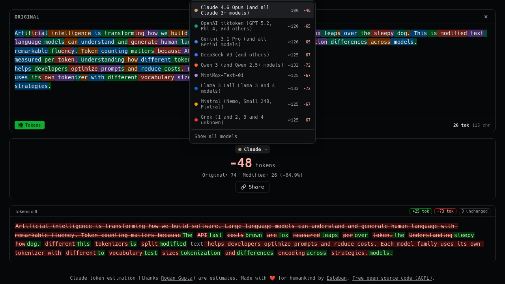

# tokencount

[](LICENSE)

Side-by-side text diff with token counts across 9 LLM tokenizers. No
framework, no build step. Also ships as an offline single-file bundle and a CLI.

[Live demo at https://tokencount.eordano.com](https://tokencount.eordano.com)



## Supported Models

| Model | `-m` flag | Covers | Tokenizer Source |
|-------|----------|--------|-----------------|
| Claude | `claude` | Claude 4.6 Opus and all Claude 3+ models | Trie-based tokenizer ([ctoc](https://github.com/rohangpta/ctoc)) |
| OpenAI | `openai` | GPT 5.2, Phi-4, and others (o200k_base) | [gpt-tokenizer](https://github.com/niieani/gpt-tokenizer) |
| Gemini | `gemini` | Gemini 3.1 Pro and all Gemini models | HuggingFace AutoTokenizer |
| DeepSeek | `deepseek` | DeepSeek V3 and others | HuggingFace AutoTokenizer |
| Qwen | `qwen` | Qwen 3 and Qwen 2.5+ models | HuggingFace AutoTokenizer |
| MiniMax | `minimax` | MiniMax-Text-01 | HuggingFace AutoTokenizer |
| Llama | `llama` | All Llama 3 and 4 models | HuggingFace AutoTokenizer |
| Mistral | `mistral` | Nemo, Small 24B, Pixtral | HuggingFace AutoTokenizer |
| Grok | `grok` | Grok 1 and 2 (3 and 4 unknown) | HuggingFace AutoTokenizer |

Models lazy-load on first use with a CJK-aware heuristic estimator while loading.

## Usage

Serve the directory with any static file server — no install required:

```bash
python3 -m http.server 8000
```

Or use the deployed instance: https://tokencount.eordano.com

**Modes:** Single-panel token counting, or **Compare two texts** for side-by-side
diffs with token deltas. **Token overlay** visualizes boundaries on your text.
**Share** encodes both texts as zbase32 in the URL — no server needed.

## CLI

```bash
nix run github:eordano/tokencount <FILE>

# Or after cloning this repo
npm run build:cli

echo "Hello world" | dist/tokencount.mjs   # default: Claude
dist/tokencount.mjs -m openai src/*.js     # specific model
dist/tokencount.mjs -a myfile.txt          # all models
```

Run `dist/tokencount.mjs --help` for full options.

## Offline Bundle

Single self-contained HTML with all models inlined — works from `file:///`:

```bash
npm install && npm run build:offline
```

Produces `dist/tokencount.html`. Pre-built bundles on
[GitHub releases](https://github.com/eordano/tokencount/releases).

## Development

```bash
git clone https://github.com/eordano/tokencount.git
cd tokencount
python3 -m http.server 8000
```

### Tests

[Screenshot viewer](https://tokencount.eordano.com/tests/screenshots/viewer.html) — auto-captured from CI (desktop + mobile).

```bash
npm install
npx playwright test   # dev server E2E (desktop + mobile)
npm run test:bundle   # offline bundle
npm run test:cli      # CLI integration
```

### Nix

```bash
nix develop           # dev shell
nix run .#build-cli   # build CLI
nix run .#test-e2e    # E2E tests
```

## License

[AGPL-3.0](LICENSE)
