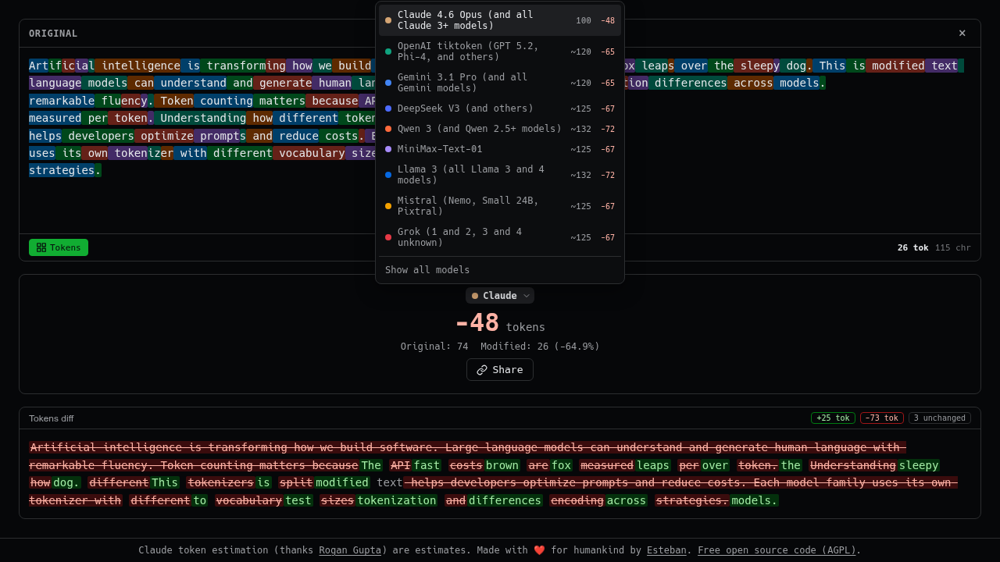

# tokencount

[](LICENSE)

Side-by-side text diff with token counts across 9 LLM tokenizers. Also ships as an offline single-file bundle and a very efficient CLI (<1ms boot).

[Live at https://tokencount.eordano.com](https://tokencount.eordano.com)



## Install

The CLI is one self-contained native binary. All 9 tokenizer tables are
compiled into it -- no runtime data files, no model downloads, no network.
Pick whichever line you already have a package manager for:

```bash
npx tokencount --help                 # run it, install nothing
npm install -g tokencount             # macOS, Linux, Windows
brew install eordano/tap/tokencount   # macOS, Linux
```

```powershell
scoop bucket add eordano https://github.com/eordano/scoop-bucket
scoop install tokencount              # Windows
winget install eordano.tokencount     # Windows
```

The tap, the Scoop bucket and the WinGet manifest live in separate repositories
and can trail a release slightly -- and none of the three works until that
repository has been populated for the first time (see
[RELEASE-PACKAGING.md](RELEASE-PACKAGING.md)). Everything below reads the GitHub
release directly and is current the moment it is published.

No package manager? The install scripts check the release's SHA256 before
anything lands on disk:

```bash
curl --proto '=https' --tlsv1.2 -fsSL https://tokencount.eordano.com/packaging/install.sh | sh
```

```powershell
irm https://tokencount.eordano.com/packaging/install.ps1 | iex
```

From a Rust or Nix toolchain:

```bash
cargo binstall --git https://github.com/eordano/tokencount tokencount
nix run github:eordano/tokencount -- --help
```

Or take an archive straight off the
[releases page](https://github.com/eordano/tokencount/releases) and check it
yourself. Prebuilt binaries are published for five targets -- x86_64 and
aarch64 Linux (static musl), Intel and Apple Silicon macOS, x86_64 Windows --
each listed in `SHA256SUMS` and covered by a Sigstore-signed
[build-provenance attestation](https://docs.github.com/actions/security-for-github-actions/using-artifact-attestations/using-artifact-attestations-to-establish-provenance-for-builds):

```bash
gh attestation verify tokencount-1.0.1-aarch64-apple-darwin.tar.gz --repo eordano/tokencount
```

That proves the file came out of this repository's release workflow, on a
GitHub-hosted runner, from a named commit -- and has not been touched since.
No long-lived credential is involved anywhere in publishing: the workflow signs
with a short-lived OIDC identity, and npm is published the same way.

**[docs/INSTALL.md](https://github.com/eordano/tokencount/blob/main/docs/INSTALL.md)**
has per-platform detail, the full verification sequence, upgrade/uninstall for
every method, and how to build from source.

## Usage

```bash
echo "Hello world" | tokencount        # default: Claude
tokencount -m openai src/*.rs          # specific model
tokencount -a myfile.txt               # all 9 models
tokencount -r --ignore node_modules .  # recursive
```

Run `tokencount --help` for full options (`-m`, `-a`, `-r`, `--ignore`,
`--no-gitignore`, `-s`/`--share`).

## Supported Models

| Model | `-m` flag | Covers | Tokenizer Source |
|-------|----------|--------|-----------------|
| Claude | `claude` | Claude 4.6 Opus and all Claude 3+ models | Trie-based tokenizer ([ctoc](https://github.com/rohangpta/ctoc)) |
| OpenAI | `openai` | GPT 5.2, Phi-4, and others (o200k_base) | [gpt-tokenizer](https://github.com/niieani/gpt-tokenizer) |
| Gemini | `gemini` | Gemini 3.1 Pro and all Gemini models | HF AutoTokenizer |
| DeepSeek | `deepseek` | DeepSeek V3 and others | HF AutoTokenizer |
| Qwen | `qwen` | Qwen 3 and Qwen 2.5+ models | HF AutoTokenizer |
| MiniMax | `minimax` | MiniMax-Text-01 | HF AutoTokenizer |
| Llama | `llama` | All Llama 3 and 4 models | HF AutoTokenizer |
| Mistral | `mistral` | Nemo, Small 24B, Pixtral | HF AutoTokenizer |
| Grok | `grok` | Grok 1 and 2 (3 and 4 unknown) | HF AutoTokenizer |

In the CLI all 9 are compiled in and always available. In the web app they
lazy-load on first use, with a CJK-aware heuristic estimator while loading.

## Web App

Serve the directory with any static file server -- no install required:

```bash
python3 -m http.server 8000
```

Or use the deployed instance: https://tokencount.eordano.com

**Modes:** Single-panel token counting, or **Compare two texts** for side-by-side
diffs with token deltas. **Token overlay** visualizes boundaries on your text.
**Share** encodes both texts as zbase32 in the URL -- no server needed.

## Offline Bundle

Single self-contained HTML with all models inlined -- works from `file:///`:

```bash
npm install && npm run build:offline
```

Produces `dist/tokencount.html`. Pre-built bundles on
[GitHub releases](https://github.com/eordano/tokencount/releases).

## CLI (Node.js)

A second CLI implementation, for environments where a native binary is awkward.
It keeps its model data in files alongside it, and boots slower than the Rust
CLI. Pre-built as `tokencount-cli.tar.gz` on releases, or:

```bash
npm run build:cli

echo "Hello world" | dist/tokencount.mjs   # default: Claude
dist/tokencount.mjs -m openai src/*.js     # specific model
dist/tokencount.mjs -a myfile.txt          # all models
```

## Development

```bash
git clone https://github.com/eordano/tokencount.git
cd tokencount
python3 -m http.server 8000
```

### Building the Rust CLI

The 8 non-Claude tokenizer tables are vendor files this repository does not
redistribute, so `build.rs` reads them from a directory you supply and fails
loudly -- naming each missing file and its source URL -- if any are absent.
Nix fetches them all at pinned hashes:

```bash
nix build .#tokencount                             # everything fetched for you

node scripts/fetch-models.mjs ./models             # or fetch them yourself,
TOKEN_COUNT_MODELS=./models cargo build --release --locked   # at pinned digests

TOKENCOUNT_ALLOW_PARTIAL=1 cargo build --release   # Claude-only binary
```

tokencount is not published to crates.io: those tables total ~90 MB against a
10 MiB registry limit, so `cargo install tokencount` could only ever produce a
Claude-only binary. See
[docs/INSTALL.md](https://github.com/eordano/tokencount/blob/main/docs/INSTALL.md#building-from-source).

### Tests

[Screenshot viewer](https://tokencount.eordano.com/tests/screenshots/viewer.html) -- auto-captured from CI (desktop + mobile).

```bash
npm install
npx playwright test   # dev server E2E (desktop + mobile)
npm run test:bundle   # offline bundle
npm run test:cli      # CLI integration
```

### Nix

```bash
nix develop              # dev shell
nix build .#tokencount   # Rust CLI + model data
nix build .#tokencount-js  # Node.js CLI + model data
nix run .#test-e2e       # E2E tests
```

## License

[AGPL-3.0](LICENSE)
